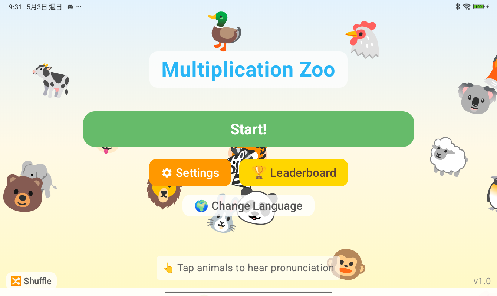
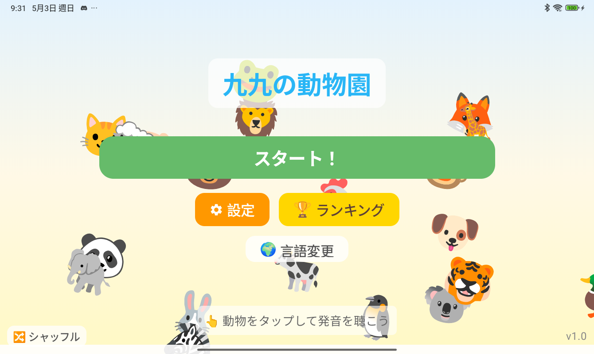
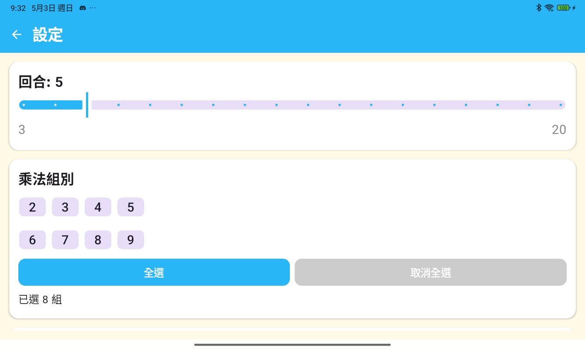
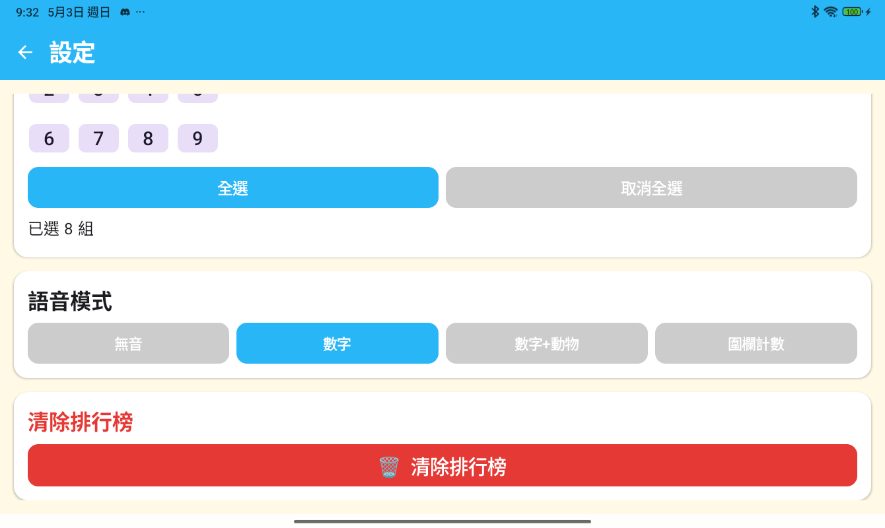
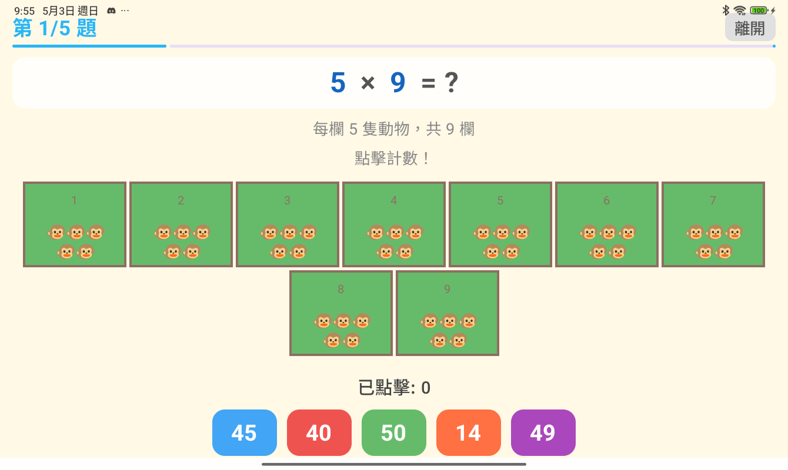
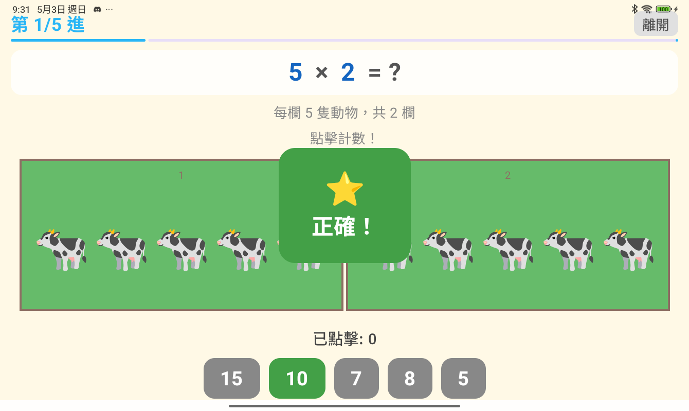
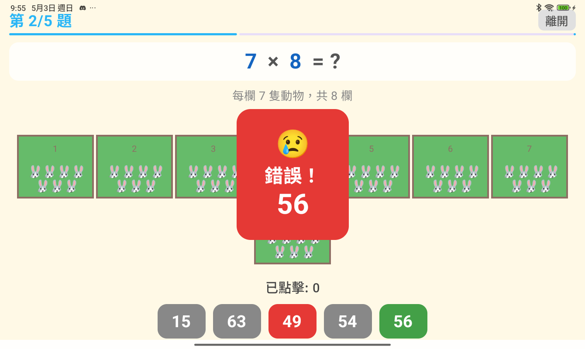
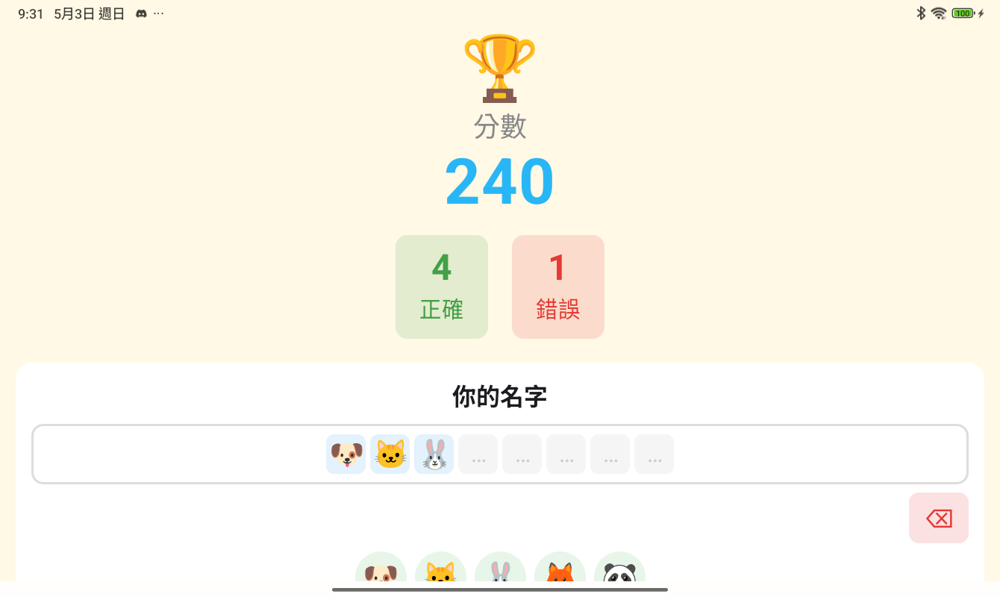
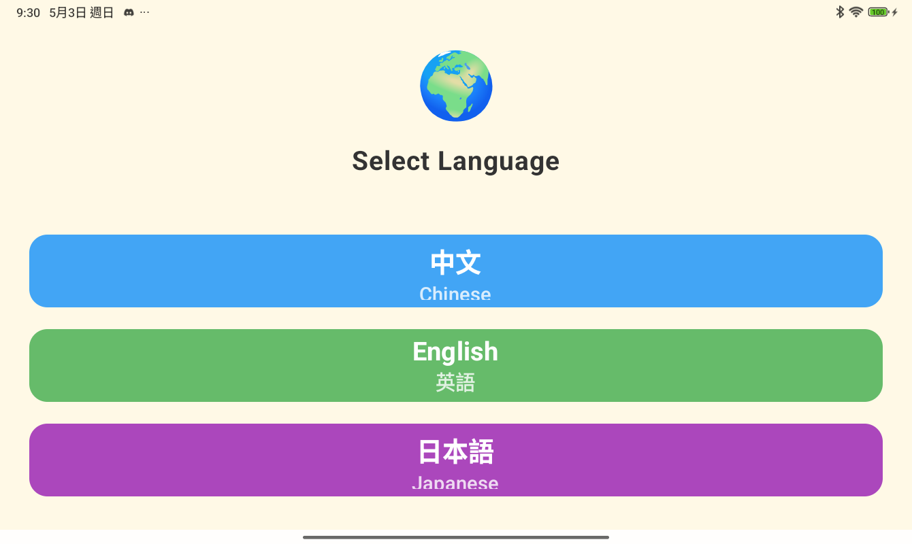

<div align="center">


# 九九乘法動物園
## Multiplication Zoo / 九九の動物園

> 用可愛動物學九九乘法！專為 **6～12 歲小朋友** 設計的互動練習 App
> A fun multiplication game for kids aged 6–12!
> かわいい動物と一緒に九九を練習しよう！

**📦 Version：1.0.2** &nbsp;｜&nbsp; 📄 License：MIT &nbsp;｜&nbsp; 📱 Platform：Android (API 31+)

</div>

---

## 🐾 這是什麼 App？ What is this?

**九九乘法動物園**用直覺的「動物柵欄」畫面，幫助孩子理解乘法的意義：

> **每欄動物數 × 欄數 = 總數**

畫面上會出現一排排可愛動物，孩子用手指點擊計數、選出正確答案，App 立刻用語音唸出正確數字和「正確！」或「錯誤！」的反饋，邊玩邊學！

A colorful "animal pen" layout makes multiplication **visual and intuitive**.
Kids tap animals to count them, then pick the right answer — with voice feedback every step of the way!

---

## 📸 App 畫面 Screenshots

### 🏠 主畫面 Home Screen

支援三種語言，主畫面隨語言完整切換：

| 繁體中文 | English | 日本語 |
|---------|---------|--------|
|  |  |  |

- 背景有 20 種可愛浮動動物 🐶🐱🐻🦁…
- **點擊動物**可聽到各語言發音（中文→英文→日文→循環）
- 點「開始遊戲」進入闖關！

---

### ⚙️ 設定畫面 Settings

| 設定頁面（上半）| 設定頁面（下半）|
|---------|---------|
|  |  |

可以調整的設定：

| 設定項目 | 說明 | 範圍 |
|---------|------|------|
| 🔢 關卡數 | 每次遊戲幾題 | 3 ～ 15 題 |
| 📚 練習乘法組 | 選 2 的倍數、3 的倍數… | 2 到 9（可複選） |
| 🔊 語音模式 | 關閉 / 唸數字 / 唸數字+動物名稱 / 唸欄位完成 | — |
| 🌍 語言 | 繁體中文 / English / 日本語 | — |

---

### 🎮 遊戲畫面 Game Screen



- 畫面上方顯示算式：**7 × 2 = ?**
- 中間是**動物柵欄**：每欄有 7 隻動物，共 2 欄
- 用手指依序**點擊動物**計數（已點擊的動物會出現反白圓框 ✅）
- 下方選出正確答案，App 語音唸出答案數字再反饋


---

### ⭐ 答對了！Correct!


答對時出現**金色星星 ⭐ 正確！** 動畫覆蓋，語音立刻唸出答案數字和「正確！」

---

### 😢 答錯了！Wrong!



答錯時出現**紅色 😢 錯誤！** 動畫，並顯示正確答案，語音唸出正確數字再說「錯誤！」

---

### 🏆 結果畫面 Result Screen



遊戲結束後：
- 顯示**分數** 🎯、答對數 ✅、答錯數 ❌
- 用 **emoji 動物**幫自己取名字（最多 8 個 emoji，可重複選）
- 儲存成績到**排行榜**！

---

### 🥇 排行榜 Leaderboard



保存最高的 10 筆成績，顯示 emoji 名字、分數、日期，鼓勵持續挑戰！

---

### 🌍 語言選擇 Language



App 支援三種語言，首次啟動時選擇，也可隨時從主畫面切換，語音也同步換語言！

---

## ✨ 功能特色 Features

- 🐾 **20 種可愛動物** 🐶🐱🐻🐼🐸🐵🐮🐷🐔🐧🦊🦁🐯🦄🦋🐬🐘🦒🦓🦘
- 🎯 **視覺化乘法**：動物柵欄讓孩子直觀理解「N × M」的意義
- 🖐️ **互動點擊計數**：點擊動物才選答案，加深記憶
- 🔊 **三語語音反饋**：中文、英文、日文 TTS 語音唸答案
- 📊 **難度可調**：選擇練習 2～9 的任意乘法群組
- 🏆 **排行榜激勵**：用 emoji 命名，留下最好成績
- 📱 **直橫式自適應**：自動依畫面大小調整動物和柵欄配置
- 🌙 **無廣告、無網路需求**：完全離線，安心給小朋友使用

---

## 👨‍👩‍👧 給家長的說明 For Parents

- 完全**免費開源**，**無廣告**、**無內購**、**無追蹤**
- 無需網路連線，**全程離線**使用
- 語音功能使用 Android 內建 TTS，**無外部伺服器**
- 支援 **Android 12 以上**裝置（平板、手機皆可）
- 推薦 **6～12 歲**使用，幼兒可在家長陪同下使用

---

## 📲 安裝方式 How to Install

### 方法一：直接安裝 APK（最簡單）
1. 前往 [Releases](../../releases) 頁面
2. 下載最新的 `app-release.apk`（已簽章、可安裝）
3. 在 Android 裝置上開啟安裝（需要允許「未知來源」安裝）
4. 若手機已安裝相同 App 但簽章不同的舊版 APK，請先解除安裝舊版再安裝新版

### 方法二：自行編譯 Build from Source
需要 Android Studio、JDK 17+

```bash
git clone https://github.com/YOUR_USERNAME/MultiplicationZoo_ANDROID.git
cd MultiplicationZoo_ANDROID
./gradlew assembleDebug
# APK 位於 app/build/outputs/apk/debug/app-debug.apk

# 建置已簽章、可安裝的 release APK
./gradlew assembleRelease
# APK 位於 app/build/outputs/apk/release/app-release.apk
```

**最低需求**：Android 12（API 31+）

---

## 🛠️ 技術資訊 Technical Info

| 項目 | 說明 |
|------|------|
| 語言 | Kotlin |
| UI | Jetpack Compose + Material3 |
| 最低 Android 版本 | Android 12 (API 31) |
| 語音 | Android 內建 TextToSpeech |
| 資料儲存 | DataStore Preferences |
| 授權 | MIT License |

---

## 📄 授權 License

```
MIT License — 自由使用、修改、散布，請保留原始授權聲明
```

詳見 [LICENSE](LICENSE) 檔案。

---

## 💬 意見回饋 Contributing

歡迎透過 Issue 回報問題或提出 Pull Request！
如果這個 App 對您的小孩有幫助，請給個 ⭐ Star 鼓勵！

---

*用愛心為孩子打造 · Made with ❤️ for kids*
